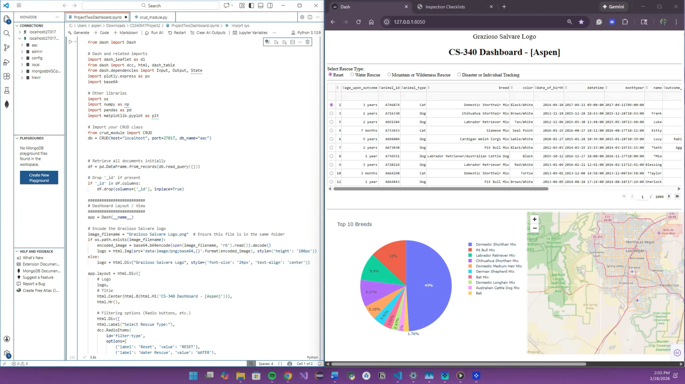

## Code Review – CS 499 Milestone One

For CS 499, I conducted a peer-style code review of my **Grazioso Salvare Animal Rescue Dashboard**, originally developed in CS 340 Client/Server Development. This artifact is a Python-based Dash application connected to a MongoDB database containing animal shelter data from the Austin, Texas area.

The purpose of the review was to analyze the existing code, identify limitations, and outline planned enhancements across three areas: software design and engineering, algorithms and data structures, and databases. The review follows professional code review practices and uses the CS 499 code review checklist as guidance.

### Code Review Video
**Watch the Code Review Video:**

  

---
### Planned Enhancements Summary
- **Software Design & Engineering:** Improve separation of concerns, reduce hardcoded logic, and strengthen error handling.
- **Algorithms & Data Structures:** Improve efficiency by moving repeated aggregation logic into MongoDB.
- **Databases:** Externalize database configuration and maintain a read-only dashboard with admin-only CRUD workflows.

### Enhancement Progress
Some of the enhancements identified in this code review have already been implemented in subsequent milestones, including improvements to database configuration, modular design, and algorithm efficiency. Remaining enhancements will continue to be refined and finalized as part of later CS 499 milestones and the final ePortfolio submission.
