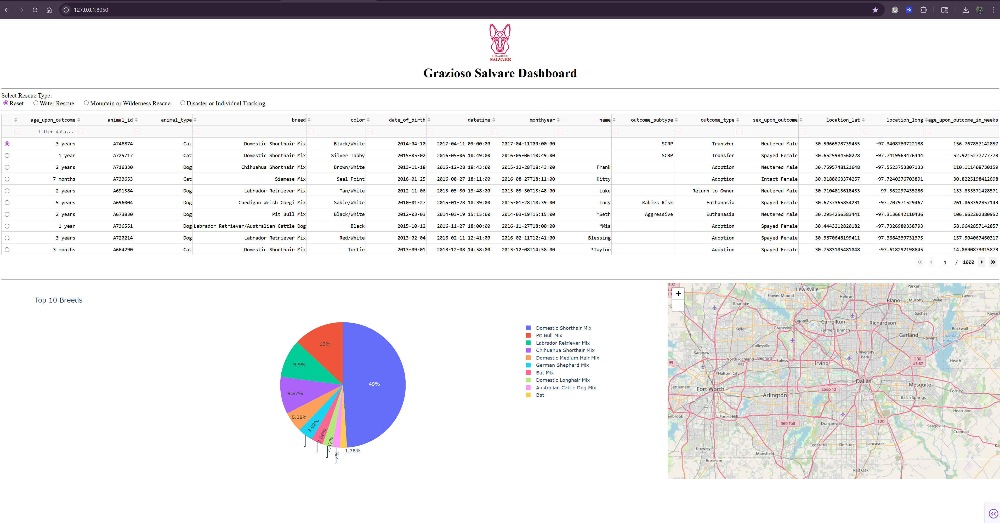

# Aspen Koreny – CS 499 ePortfolio
Backend-focused developer building scalable data systems, secure database architectures, and performance-driven applications.
### Technical Focus

- Database Architecture (MongoDB)
- Secure Data Access Layers
- Aggregation & Data Processing
- API-Driven Design

  
Welcome to my Computer Science Capstone ePortfolio.

This portfolio highlights enhanced work demonstrating growth in:

- Software Design and Engineering  
- Algorithms and Data Structures  
- Databases  

Each artifact includes a reflection narrative outlining the enhancement process, technical decisions, and alignment with program outcomes.
---
## Professional Self-Assessment

This self-assessment reflects on my growth throughout the Computer Science program and how I am positioning myself professionally.

<strong>Click to read my full self-assessment</strong>

---

### Professional Identity & Direction

Completing the Computer Science program and developing my ePortfolio has allowed me to clearly define my technical interests and professional direction. Through structured coursework and applied projects, I have developed into a backend-focused developer with a strong foundation in database architecture, algorithm optimization, and secure system design. What began as broad curiosity about technology evolved into a focused interest in scalable data systems and architectural decisions that support long-term maintainability and security.

---

### System Design & Iterative Improvement

Throughout the program, I learned that strong software development is not just about writing code, but about building systems that serve real organizational needs. My selected artifact, the *Grazioso Salvare Animal Rescue Dashboard*, reflects that mindset. Originally created in CS 340 (Client/Server Development), it began as a functional database-driven dashboard. Through the capstone process, I enhanced it across software design, algorithms and data structures, and database architecture.

Each enhancement was deliberate and iterative, reinforcing structured problem-solving and production-minded thinking.

---

### Communication & Professional Strength

Clearly articulating technical decisions has been central to my academic and professional growth. In my current role as a talent acquisition specialist, I collaborate with systems administrators and stakeholders to improve reporting workflows and data processes. Translating technical details into accessible explanations for non-technical users has become one of my strengths.

This capability is reflected in my structured code review and written narratives, where I explain not only what changes were implemented, but why they were necessary. Conducting a formal code review reinforced the importance of clarity, documentation, and constructive evaluation within collaborative engineering environments.

---

### Algorithms & Performance Optimization

From an algorithmic perspective, I strengthened my ability to design and evaluate computing solutions using appropriate data structures and performance trade-offs. In my enhancement work, I relocated aggregation logic from the application layer to MongoDB using an aggregation pipeline. This reduced redundant computation and improved scalability while simplifying application logic.

This experience reinforced my understanding of algorithm placement and system-level performance implications.

---

### Security & Database Architecture

Enhancing the database significantly improved my security awareness and architectural decision-making. Rather than exposing full CRUD functionality through the user-facing dashboard, I separated administrative operations into a controlled command-line workflow. This adheres to the principle of least privilege.

Additionally, I externalized database configuration using environment variables instead of hardcoding credentials. These changes reflect a developing security mindset that anticipates misuse, reduces attack surface, and prioritizes maintainability.

---

### Integration of Technical & Professional Experience

Beyond the artifact itself, the program has reshaped how I approach backend systems and data-driven decision-making. In my professional work, I analyze hiring data, improve reporting workflows, and collaborate with HR systems administrators. The technical skills developed in this program — database querying, algorithm optimization, modular design, and secure configuration — directly support and expand those responsibilities.

I now approach systems not only as a user, but as a builder who understands the infrastructure behind them.

---

### Future Direction

Rather than presenting unrelated projects, I chose to deepen and expand a single artifact across multiple dimensions. This allowed me to demonstrate layered improvement in structural refinement, performance optimization, and security hardening.

I am particularly interested in backend development and data systems roles involving database architecture, analytics platforms, or system optimization. I plan to continue strengthening my understanding of distributed systems and scalable architecture while maintaining a security-conscious perspective.

---

Ultimately, this portfolio represents more than a completed assignment — it reflects structured growth, applied backend engineering principles, and intentional professional direction.

---

## Informal Code Review

As the foundation for this capstone, I conducted a structured peer-style code review of my original *Grazioso Salvare Animal Rescue Dashboard* to identify architectural improvements across software design, algorithm efficiency, and database security.

 **Watch the Code Review Video:**  
[View Code Review on YouTube](https://youtu.be/veKNYrXu9U0)

 **Read the Code Review Summary:**  
[Code Review Documentation](code-review.md)

---

## Artifact Source Files
The original CS 340 implementation and the enhanced CS 499 version are both preserved below to demonstrate architectural refactoring, algorithmic improvements, and database security enhancements.

### Original Artifact (CS 340 Client/Server Development Version)

- [Original CRUD Module](artifact/original/crud_module.py)
- [Original Dashboard Notebook](artifact/original/ProjectTwoDashboard.ipynb)

### Enhanced Artifact (CS 499 CS Capstone Version)

- [Enhanced CRUD Module](artifact/enhanced/crud_module_enhanced.py)
- [Enhanced Admin Tools](artifact/enhanced/admin_tools.py)
- [Enhanced Dashboard Notebook](artifact/enhanced/ProjectTwoDashboard_enhanced.ipynb)

## Artifact Enhancement Narratives

-  [Software Design & Engineering Enhancement](artifact/enhancement-software-design-narrative.md)  
-  [Algorithms & Data Structures Enhancement](artifact/enhancement-algorithms-narrative.md)  
-  [Database & Security Enhancement](artifact/enhancement-databases-narrative.md)

---
### Interactive MongoDB + Dash Data Visualization Dashboard

The enhanced Grazioso Salvare dashboard integrates MongoDB data retrieval, aggregation pipelines, and Plotly visualizations into an interactive analytics interface.

**Tech Stack:** Python · MongoDB · Dash · Plotly · Aggregation Pipelines

---

This portfolio represents the integration of structured computer science education, applied backend development, and intentional professional growth.
---
